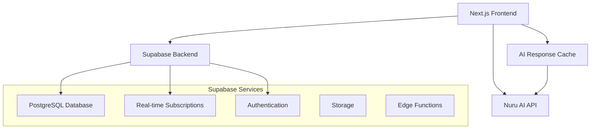

# Nuru-Learn Production Implementation Plan

## 🎯 Objective
Transform Nuru-Learn from a demo app to a production-ready educational platform for Kpelle language learning with Supabase backend integration.

## 🏗️ Architecture Overview



## 📊 Database Schema

### Core Tables

#### 1. **users** (Authentication + Profile)
```sql
CREATE TABLE users (
  id UUID PRIMARY KEY DEFAULT gen_random_uuid(),
  email TEXT UNIQUE NOT NULL,
  name TEXT NOT NULL,
  avatar_url TEXT,
  proficiency_level TEXT DEFAULT 'beginner' CHECK (proficiency_level IN ('beginner', 'intermediate', 'advanced')),
  preferred_subjects TEXT[] DEFAULT ARRAY['language-arts'],
  daily_goal_minutes INTEGER DEFAULT 30,
  settings JSONB DEFAULT '{"notifications": true, "soundEnabled": true, "theme": "system"}',
  created_at TIMESTAMP WITH TIME ZONE DEFAULT NOW(),
  updated_at TIMESTAMP WITH TIME ZONE DEFAULT NOW()
);
```

#### 2. **user_progress** (Learning Progress)
```sql
CREATE TABLE user_progress (
  id UUID PRIMARY KEY DEFAULT gen_random_uuid(),
  user_id UUID REFERENCES users(id) ON DELETE CASCADE,
  total_xp INTEGER DEFAULT 0,
  current_streak INTEGER DEFAULT 0,
  longest_streak INTEGER DEFAULT 0,
  lessons_completed INTEGER DEFAULT 0,
  activities_completed INTEGER DEFAULT 0,
  average_accuracy FLOAT DEFAULT 0,
  time_spent_minutes INTEGER DEFAULT 0,
  level INTEGER DEFAULT 1,
  updated_at TIMESTAMP WITH TIME ZONE DEFAULT NOW(),
  UNIQUE(user_id)
);
```

#### 3. **daily_progress** (Daily Learning Tracking)
```sql
CREATE TABLE daily_progress (
  id UUID PRIMARY KEY DEFAULT gen_random_uuid(),
  user_id UUID REFERENCES users(id) ON DELETE CASCADE,
  date DATE NOT NULL,
  sessions_today INTEGER DEFAULT 0,
  xp_today INTEGER DEFAULT 0,
  minutes_today INTEGER DEFAULT 0,
  lessons_today INTEGER DEFAULT 0,
  challenge_completed BOOLEAN DEFAULT FALSE,
  streak_maintained BOOLEAN DEFAULT FALSE,
  created_at TIMESTAMP WITH TIME ZONE DEFAULT NOW(),
  UNIQUE(user_id, date)
);
```

#### 4. **user_achievements** (Badges & Awards)
```sql
CREATE TABLE user_achievements (
  id UUID PRIMARY KEY DEFAULT gen_random_uuid(),
  user_id UUID REFERENCES users(id) ON DELETE CASCADE,
  achievement_type TEXT NOT NULL, -- 'streak', 'xp', 'accuracy', 'completion'
  title TEXT NOT NULL,
  description TEXT,
  icon TEXT DEFAULT 'trophy',
  xp_reward INTEGER DEFAULT 10,
  earned_at TIMESTAMP WITH TIME ZONE DEFAULT NOW()
);
```

#### 5. **learning_sessions** (Session Tracking)
```sql
CREATE TABLE learning_sessions (
  id UUID PRIMARY KEY DEFAULT gen_random_uuid(),
  user_id UUID REFERENCES users(id) ON DELETE CASCADE,
  subject TEXT NOT NULL,
  activity_type TEXT, -- 'vocabulary', 'conversation', 'quiz', etc.
  duration_minutes INTEGER NOT NULL,
  accuracy FLOAT,
  xp_earned INTEGER DEFAULT 0,
  questions_answered INTEGER DEFAULT 0,
  correct_answers INTEGER DEFAULT 0,
  lesson_data JSONB, -- Stores lesson content and user responses
  completed_at TIMESTAMP WITH TIME ZONE DEFAULT NOW()
);
```

#### 6. **ai_response_cache** (Smart Caching)
```sql
CREATE TABLE ai_response_cache (
  id UUID PRIMARY KEY DEFAULT gen_random_uuid(),
  request_hash TEXT UNIQUE NOT NULL,
  request_data JSONB NOT NULL,
  response_data JSONB NOT NULL,
  cache_category TEXT DEFAULT 'general', -- 'lesson', 'vocabulary', 'conversation'
  usage_count INTEGER DEFAULT 1,
  created_at TIMESTAMP WITH TIME ZONE DEFAULT NOW(),
  expires_at TIMESTAMP WITH TIME ZONE DEFAULT NOW() + INTERVAL '7 days'
);

-- Index for fast cache lookups
CREATE INDEX idx_ai_cache_hash ON ai_response_cache(request_hash);
CREATE INDEX idx_ai_cache_expires ON ai_response_cache(expires_at);
```

#### 7. **generated_lessons** (Content Library)
```sql
CREATE TABLE generated_lessons (
  id UUID PRIMARY KEY DEFAULT gen_random_uuid(),
  title TEXT NOT NULL,
  description TEXT,
  subject TEXT NOT NULL,
  difficulty_level TEXT DEFAULT 'beginner',
  estimated_duration INTEGER DEFAULT 20, -- minutes
  content JSONB NOT NULL, -- Full lesson structure
  language TEXT DEFAULT 'kpe',
  created_by UUID REFERENCES users(id),
  usage_count INTEGER DEFAULT 0,
  rating FLOAT DEFAULT 0,
  is_public BOOLEAN DEFAULT TRUE,
  created_at TIMESTAMP WITH TIME ZONE DEFAULT NOW()
);
```

### Triggers & Functions

#### Update Timestamps
```sql
CREATE OR REPLACE FUNCTION update_updated_at_column()
RETURNS TRIGGER AS $$
BEGIN
    NEW.updated_at = NOW();
    RETURN NEW;
END;
$$ language 'plpgsql';

CREATE TRIGGER update_users_updated_at BEFORE UPDATE ON users
FOR EACH ROW EXECUTE FUNCTION update_updated_at_column();

CREATE TRIGGER update_user_progress_updated_at BEFORE UPDATE ON user_progress
FOR EACH ROW EXECUTE FUNCTION update_updated_at_column();
```

#### Auto-create User Progress
```sql
CREATE OR REPLACE FUNCTION create_user_progress()
RETURNS TRIGGER AS $$
BEGIN
    INSERT INTO user_progress (user_id) VALUES (NEW.id);
    RETURN NEW;
END;
$$ language 'plpgsql';

CREATE TRIGGER create_user_progress_trigger
AFTER INSERT ON users
FOR EACH ROW EXECUTE FUNCTION create_user_progress();
```

## 🔧 Implementation Phases

### Phase 1: Backend Setup (Week 1)
- [x] Set up Supabase project
- [ ] Create database schema
- [ ] Set up authentication
- [ ] Create Row Level Security policies
- [ ] Set up basic API client

### Phase 2: Core Features (Week 2)
- [ ] User authentication flow
- [ ] Progress tracking system
- [ ] Learning streak logic
- [ ] Achievement system
- [ ] Real-time updates

### Phase 3: AI Integration (Week 3)
- [ ] Smart caching system
- [ ] Content generation pipeline
- [ ] Response optimization
- [ ] Error handling & fallbacks

### Phase 4: Production Features (Week 4)
- [ ] Performance optimization
- [ ] Monitoring & analytics
- [ ] Backup strategies
- [ ] Deployment pipeline

## 🎮 Feature Enhancements

### Learning Gamification
- **Streaks**: Daily learning streaks with streak freezes
- **XP System**: Experience points for all activities
- **Levels**: User progression through levels (1-100)
- **Badges**: Achievement system with unique rewards
- **Leaderboards**: Weekly/monthly community challenges

### AI-Powered Features
- **Adaptive Learning**: AI adjusts difficulty based on performance
- **Personalized Content**: Generate lessons based on user interests
- **Smart Review**: AI identifies weak areas for focused practice
- **Cultural Context**: Integrate Liberian cultural elements

### Social Features
- **Study Groups**: Virtual learning communities
- **Peer Challenges**: Friend competitions and collaborative goals
- **Cultural Exchange**: Connect learners with native speakers
- **Progress Sharing**: Celebrate achievements with community

## 🔒 Security & Privacy

### Row Level Security (RLS)
```sql
-- Users can only see their own data
ALTER TABLE user_progress ENABLE ROW LEVEL SECURITY;
CREATE POLICY "Users can view own progress" ON user_progress FOR SELECT USING (auth.uid() = user_id);
CREATE POLICY "Users can update own progress" ON user_progress FOR UPDATE USING (auth.uid() = user_id);

-- Daily progress
ALTER TABLE daily_progress ENABLE ROW LEVEL SECURITY;
CREATE POLICY "Users can view own daily progress" ON daily_progress FOR ALL USING (auth.uid() = user_id);

-- Learning sessions
ALTER TABLE learning_sessions ENABLE ROW LEVEL SECURITY;
CREATE POLICY "Users can view own sessions" ON learning_sessions FOR ALL USING (auth.uid() = user_id);
```

### Data Protection
- Encrypt sensitive user data
- Implement GDPR compliance
- Regular security audits
- Secure API endpoints

## 📈 Performance Optimization

### Caching Strategy
1. **AI Response Cache**: 7-day TTL for similar requests
2. **Content Cache**: CDN for static educational content
3. **User Session Cache**: Redis for active sessions
4. **Database Query Cache**: Optimize frequent queries

### Real-time Features
- Live progress updates
- Instant achievement notifications
- Real-time streak maintenance
- Collaborative learning sessions

## 🚀 Deployment & DevOps

### CI/CD Pipeline
```yaml
# GitHub Actions
name: Deploy Nuru-Learn
on:
  push:
    branches: [main]
jobs:
  deploy:
    runs-on: ubuntu-latest
    steps:
      - uses: actions/checkout@v3
      - name: Deploy to Vercel
      - name: Run Database Migrations
      - name: Update Supabase Functions
```

### Monitoring
- **Uptime**: Monitor API availability
- **Performance**: Track response times
- **Usage**: Monitor AI API costs
- **Errors**: Real-time error tracking

## 📊 Analytics & Insights

### Learning Analytics
- Track user engagement patterns
- Measure learning effectiveness
- Identify popular content
- Monitor progress trends

### AI Usage Analytics
- Cache hit rates
- Response quality metrics
- Cost optimization
- Model performance

## 🌍 Scalability Plan

### Horizontal Scaling
- Load balancing for API endpoints
- Database read replicas
- CDN for global content delivery
- Microservices architecture

### Cost Optimization
- Smart AI caching reduces API costs
- Efficient database queries
- Content delivery optimization
- Auto-scaling infrastructure

---

## 🎯 Success Metrics

### User Engagement
- Daily active users
- Session duration
- Completion rates
- Streak maintenance

### Learning Effectiveness
- Progress velocity
- Accuracy improvements
- Retention rates
- User satisfaction

### Technical Performance
- 99.9% uptime
- <500ms response times
- 90%+ cache hit rate
- Cost per user <$2/month

---

*This production plan transforms Nuru-Learn into a scalable, engaging educational platform that showcases Nuru AI's capabilities while providing real value to Kpelle language learners.*
